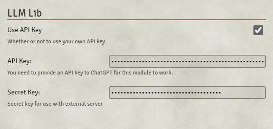

# LLM-Lib

LLM-Lib is a Foundry VTT Module that calls ChatGPT to chat or generate NPCs for your home campaign. Use with the [AI Actors](https://github.com/rachsg7/ai-actors) Module for full functionality. 

## How to Use

To use this Module you need a ChatGPT API key. [Click here](https://help.openai.com/en/articles/7039783-how-can-i-access-the-chatgpt-api) for more information on creating and using your own API key. This does cost some money, but each API call by itself is not expensive. 

Once you have your API key, open LLM-Lib settings, paste it in the API Key, and check the "Use API Key" box. 

For now, leave the Secret Key blank. This hooks into a premium server with extra checks on Actor creation. Look forward to this in a future update. 